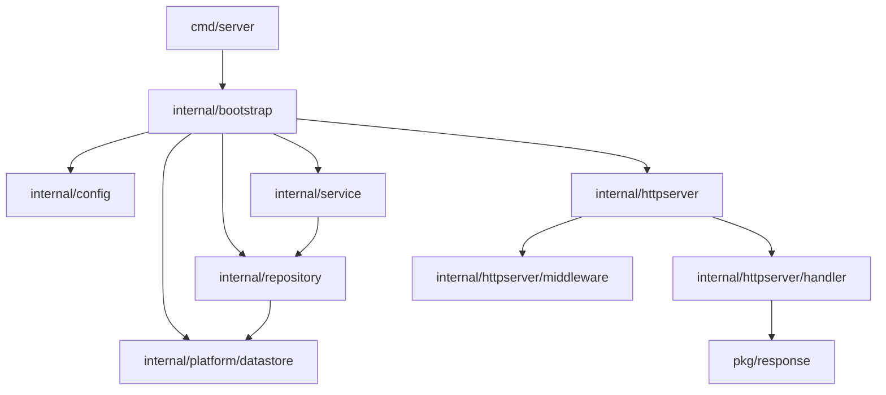
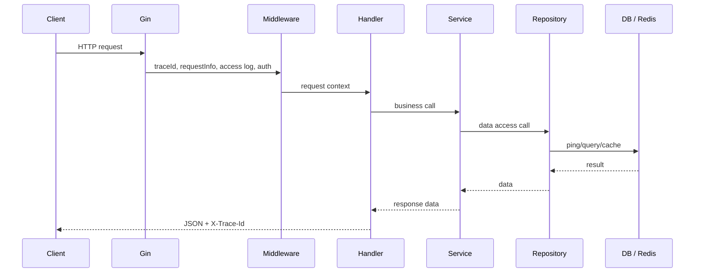
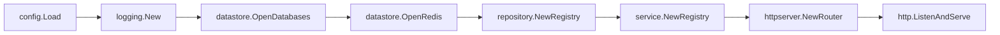

# 2026-06-26  封装go scaffold 脚手架
gin zap 
- 集成 RequestInfo、TraceId、日志、鉴权 ... 常用中间件
- gorm 数据库 Redis

## 
```sh
# 生产swager 文档
swag init -g cmd/server/main.go -d . -o swdocs
# 指定稳定生成目录，不全部扫描 internal/httpserver/handler
# 将-g 所在目录放在-d 的第一项(cmd/server)，带上行response的目录(pkg)
# 减少扫描目录
swag init  -g main.go  -d cmd/server,internal/httpserver/handler,pkg -o swdocs
```


# Architecture 结构图 


## 结构说明
```
cmd
└── server
    └── main.go


internal
├── bootstrap
│   └── app.go
├── config
│   └── config.go
├── platform
│   └── datastore
│   └── database.go
│     └── redis.go
│   └── logging
│     └── gorm.logger.go
│     └── logger.go
├── repository
├── service
├── httpserver
│   ├── middleware
│   └── handler


pkg
├── response
├── errno
├── jwt
└── constant
```

## Directory Graph



## Request Flow



## Bootstrap Flow

